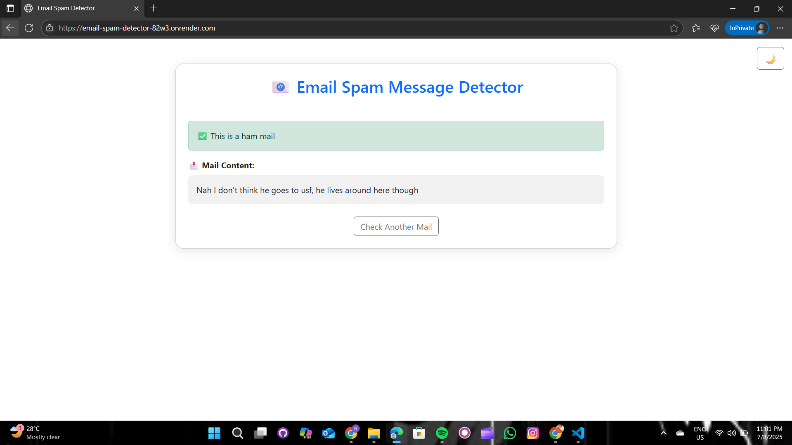
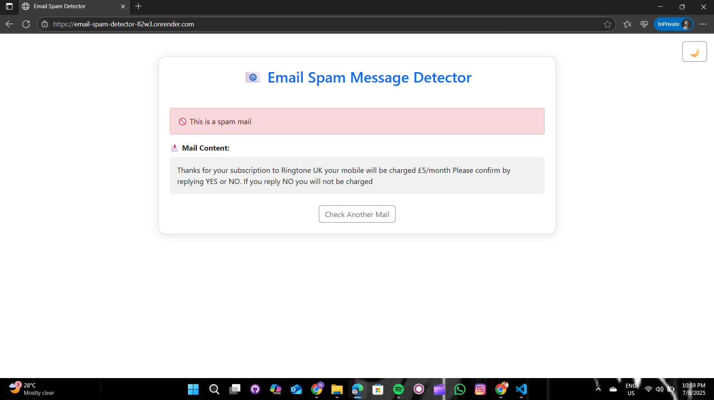

# 📧 Email Spam Detection – ML Project

A lightweight web app that classifies emails as **Spam** or **Ham** using Machine Learning.

---

## 🚩 Problem Statement  
Spam emails can affect productivity and pose security risks. This project aims to automatically detect and filter spam messages using ML.

---

## 🎯 Objective  
To build a spam classifier using **Naive Bayes** or **SVM**, and deploy it through a simple, user-friendly web interface.

---

## 🛠️ Tech Stack

- **Python**, **Flask**  
- **Scikit-learn**, **Pandas**  
- **HTML + Bootstrap** (with Dark/Light Mode)

---

## 🔍 Workflow

1. **Preprocessing**
   - Cleaned email text  
   - Removed stopwords  
   - Tokenized & applied TF-IDF

2. **Modeling**
   - Trained using **Logistic Regression** or **Naive Bayes**  
   - Evaluated using **accuracy**, **precision**, and **recall**

3. **Deployment**
   - Web interface built using Flask  
   - Users can input an email and receive real-time classification as spam or ham

---

## 🚀 How to Run Locally (Using VS Code)

1. Open **VS Code**
2. Use the terminal or `Ctrl + \`` to open a new terminal
3. Create and activate a virtual environment (optional but recommended):
    ```bash
    python -m venv venv
    source venv/bin/activate  # On Windows: venv\Scripts\activate
    ```
4. Install dependencies:
    ```bash
    pip install -r requirements.txt
    ```
5. Run the app:
    ```bash
    python app.py
    ```
6. Open your browser and go to:
    ```
    http://127.0.0.1:5000/
    ```
---
## 🌐 Live Hosted App
👉 [Click here to use the app](https://email-spam-detector-hvpu.onrender.com)

## 📁 Project Structure
 
|         File/Folder                 |            Description                   |
|-------------------------------------|------------------------------------------|
| `app.py`                            | Flask backend logic                      |
| `index.html`                        | Web frontend with dark/light toggle      |
| `mail_data.csv`                     | Email dataset                            |
| `feature_extraction.pkl`            | Saved TF-IDF vectorizer                  |
| `logistic_regression.pkl`           | Trained ML model                         |
| `email_spam_detector.ipynb`         | Jupyter notebook with full ML pipeline   |
| `Screenshot/`                       | Folder containing sample classification screenshots |

---

## ✅ Results

- Achieved **90%+ accuracy** in spam detection  
- Easy to integrate into email clients or web forms

---

## 📸 Sample Output

### ✅ Ham (Not Spam) Classifier Output
> - "Hey Anant, don't forget we have class at 10 AM tomorrow."  
> - "Your electricity bill of ₹500 is due on 10th July."


---

### 🚫 Spam Classifier Output
> - "Congratulations! You’ve won ₹1,00,000. Click here to claim!"  
> - "Your bank account has been blocked. Login here to fix it: fake-link.com"




---

## 👨‍💻 Developed By

**Anant Kiranmauli**  
🎓 Electrical Engineering Student  
📍 Government Polytechnic, Munger  
🧠 Interests: Coding, Logic, and Engineering Applications

---
